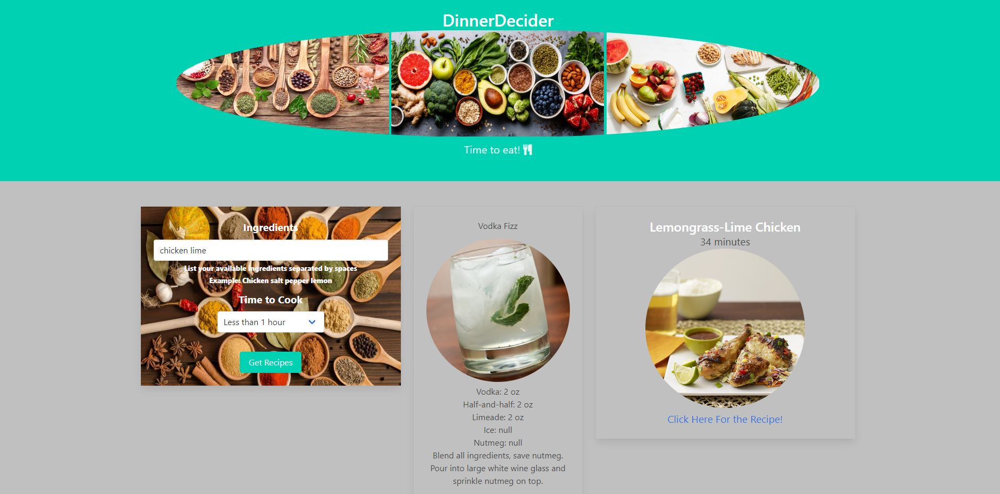
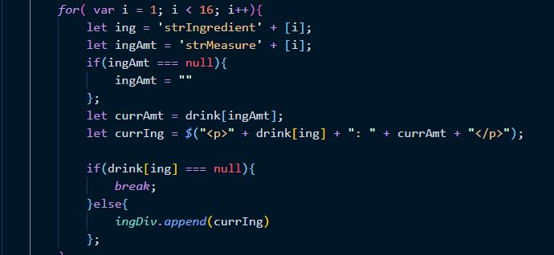

# DinnerDecider
User story:
Our application allows users to input different types of ingredients, as well as a time allotment, into a search bar. The website then outputs a recipe based on the search terms. Additionally, the user can view a random drink via the user interface.

Here is a deployed website that has the ability to input ingredients that the user has, or a craving the user might have, and output a recipe based on those, as well as time allotted. 

This website was build using Bulma HTML framework, and JQuery Javascript library.

Below are some of the ways we utilized items to our advantage:

In the header, by building an image, and giving it a radius, the curved oval look was achieved.

The API call to pull the beverage did not put the drink ingredients into an array, or object. It returned the info as multiple objects as "strIngredient" and a numerical value, as seen below.

The solution we came up with was to utilize a "for" loop, and an exit parameter when it landed on a "null" return.

